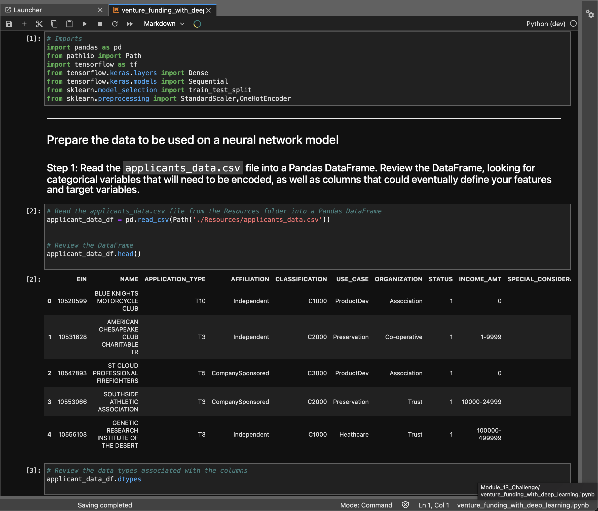
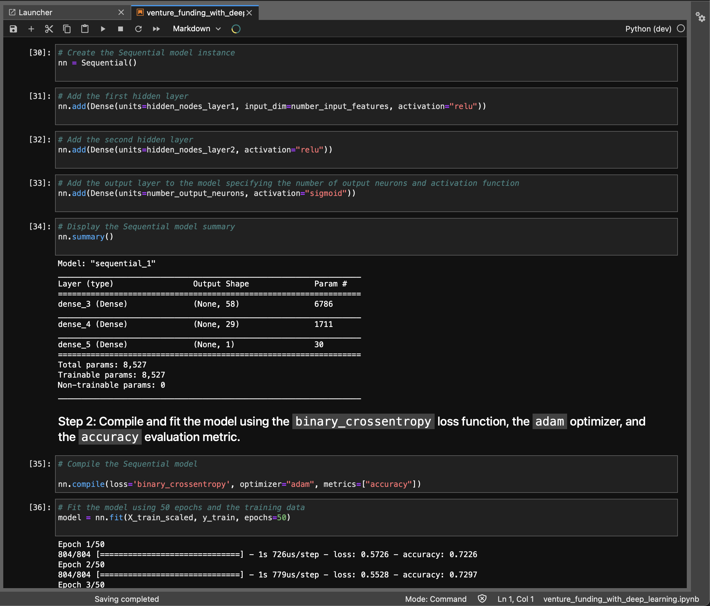

# Venture Funding with Deep Learning / Module 12 Challenge
---

This is a code created with a Jupyter Lab Notebook used with the assitance of Pandas to create a deep learning model thats trained and tested in order to familiarize myselffr with the many uses of neural networks.
## Technologies

This project uses python 3.7 with the following packages:

* [Pandas](https://github.com/pandas-dev/pandas) - Pandas is an open-source library that offers easy-to-use data analysis tools for Python.

* [Jupyter Lab](https://jupyter.org) - For an intuitive notebook IDE

* [scikit-learn](https://scikit-learn.org/stable/) - For sofisticated machine learning models


 
---

## Installation Guide

Before running the application first install the following:


* [Install] Anaconda with Python 3.7+(https://docs.anaconda.com/anaconda/install/)
You should always be in a conda dev environment when launching JupyterLab.


---

## Install/Import the following libraries and dependencies 

```python
# Install the required libraries
conda install -c conda-forge imbalanced-learn
conda install -c conda-forge pydotplus

# Import the modules
import numpy as np
import pandas as pd
from pathlib import Path
from tensorflow.keras.layers import Dense
from tensorflow.keras.models import Sequential
from sklearn.model_selection import train_test_split
from sklearn.preprocessing import StandardScaler,OneHotEncoder
```
---

## Usage

To view the venture_funding_with_deep_learning.ipynb, open file via Jupyter Lab

```conda activate dev
cd <location of (venture_funding_with_deep_learning.ipynb)>
jupyter lab
```

Upon launching the Jupyter Lab NOTEBOOK you will be greeted with the following prompts.




As Well as the following model creations




---

## Contributors

Brought to you by MartyCodes333 (martique.henton@gmail.com) with the help of 2021 UW FinTech Bootcamp Instructors, TA's and Fellow Classmates